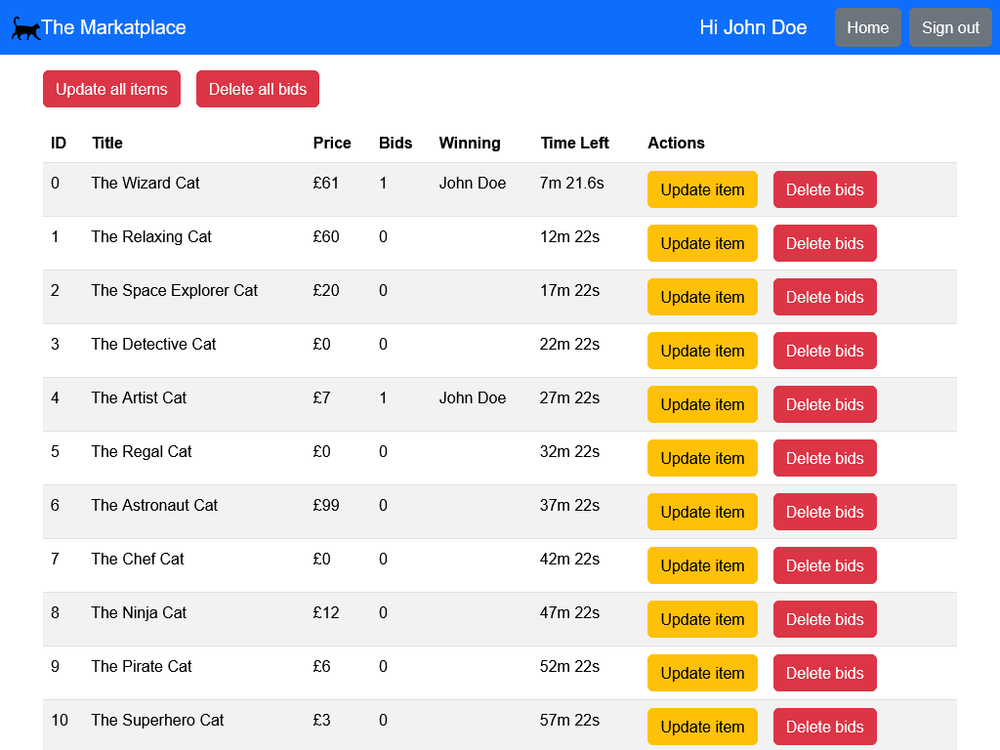

# Auction Website

In this repo you will find the code and instructions to host an auction website for free using GitHub Pages and Firebase anonymous authentication & databases.

This is a project I originally worked on for a charity event and I've been improving it in my spare time ever since. Contributions and suggestions are welcome!

## Table of contents

- [Table of contents](#table-of-contents)
- [Features](#features)
- [Setup](#setup)
  - [Environment](#environment)
  - [Items](#items)
  - [Firebase](#firebase)
    - [Creating a project](#creating-a-project)
    - [Authentication](#authentication)
    - [Firestore Database](#firestore-database)
  - [Creating an admin account](#creating-an-admin-account)
  - [Initialising the auction](#initialising-the-auction)

## Features

Realtime bidding using event listeners (no need to refresh page).

Built with Bootstrap so everything is reactive:

<p>
  
  
</p>

Device based login requiring only a username to be provided (no need to store sensitive information):


Popup additional item details and an additional image (same image was used for demo):


Admin page for administrators to monitor the auction more easily and see who's winning:



## Setup

Here we will cover how to add your own information to the auctions themselves, finally how to connect it all to Firebase to enable user login and bidding.

### Environment

To develop and deploy your own auction, you'll need to install Node.js v21. To do this, follow the instructions [here](https://nodejs.org/en/learn/getting-started/how-to-install-nodejs).

Then, install the required packages as follows:

```shell
npm install
```

You can start the development server by running:

```shell
npm run dev
```

You can build for production and preview the production build by running:

```shell
npm run build
npm run preview
```

Your website will deploy automatically using the [.github\workflows\pages.yml](.github\workflows\pages.yml).

### Items

First, set `demo = false` in [src/App.jsx](src\App.jsx) (this stop the timers from automatically resetting).

Then, populate [public\items.yml](public\items.yml) with the information for of the items you'll be putting up for auction. The fields are:
- `id` (`Number`): the ID of the item
- `primaryImage` (`String`): URL of the primary image (relative if included in `public`, absolute if hosted elsewhere)
- `title` (`String`): item title
- `subtitle` (`String`): item subtitle
- `detail` (`String`): item detail text
- `secondaryImage` (`String`): URL of the secondary image (relative if included in `public`, absolute if hosted elsewhere)
- `currency` (`String`): the currency symbol to use
- `amount` (`Number`): item starting price,
- `endTime` (`string`): item end time in [ISO 8601 format](https://tc39.es/ecma262/#sec-date-time-string-format) (`YYYY-MM-DDTHH:mm:ss.sssZ`)

### Firebase

Here we will cover how to set up your Firebase project and then how to enable the Firebase authentication and database respectively.

#### Creating a project

You can create a project using the following steps:
- Head to the [Firebase console](https://console.firebase.google.com/) where you can manage your projects.
- Click `Add project` and name your project.
- Then you may enable or disable Google Analytics at your discretion.
- You will then be taken to your project's overview where you will add a web app to your project by clicking `Add app` and selecting the web app icon (the app's name is arbitrary and is only used to identify the app within your project if, for example, you had multiple apps in the same project).
- Now that you have created an app you should be shown a code snippet containing `firebaseConfig`. Copy everything inside `firebaseConfig` to the `firebaseConfig` variable in [src\firebase\config.jsx](src\firebase\config.jsx).

> The code snippet containing `firebaseConfig` and the current version can be found in `Project settings` if you need to refer to it later.

#### Authentication

Head to your project's console and click on `Authentication` in the menu on the left. Then go to the `Sign-in method` tab and enable the Anonymous sign-in provider.

Anonymous authentication is tied to the user's browser. This means that if the user uses a different browser, or clears their site data, they will appear as a new user when they next sign up.

You can read more about anonymous authentication in the [documentation](https://firebase.google.com/docs/auth/web/anonymous-auth).

#### Firestore Database

To set up Firestore, follow the [Firestore quickstart documentation](https://firebase.google.com/docs/firestore/quickstart).

Next, navigate to the `Rules` tab and paste the following rules:

```js
rules_version = '2';
service cloud.firestore {
  match /databases/{database}/documents {
    // Checks that new data doesn't overwrite or delete an existing bid
    function isFieldOverWrite() {
      let editedKeys = request.resource.data.diff(resource.data);
      return editedKeys.changedKeys().union(editedKeys.removedKeys()).size() > 0
    }
    // Checks user has anonymous account and has "signed up" (i.e. provided a displayName)
    function isLoggedIn() {
      return request.auth != null && exists(/databases/$(database)/documents/users/$(request.auth.uid))
    }
    // Checks the user is logged in and if their user data contains the admin password
    function isAdmin() {
      return isLoggedIn() && get(/databases/$(database)/documents/users/$(request.auth.uid)).data.admin == "insert long random secret string"
    }
    // Make sure the uid of the requesting user matches name of the user
    // document. The wildcard expression {userId} makes the userId variable
    // available in rules.
    match /users/{userId} {
      allow read, update, delete: if isAdmin() || request.auth != null && request.auth.uid == userId;
      allow create: if request.auth != null && request.auth.uid == userId;
    }
    // Auction can always be read, updated only if the user is logged in and
    // isn't overwiting someone else's bid, and created or deleted by admins
    match /auction/items {
      allow get, list: if true;
      allow update : if isAdmin() || isLoggedIn() && !isFieldOverWrite()
      allow create, delete: if isAdmin();
    }
  }
}
```

These rules state that:
- Users can only read and write to their own user data, keeping usernames private and admin passwords.
- The auction document may be read by anyone and only updated if the user is logged in and is not modifying or deleting existing bids. This document is what your clients will fetch the current state of the auction from. No usernames are stored here, only the bid amount and the user's UID (which is randomly generated by Firebase and is completely non-identifying to any prying eyes).
- Admins can access all auction and user data.

### Creating an admin account

The final step in setting up your auction is to create an admin account and use it to initialise and monitor your auction.

To create an admin account:
- Host your website either locally or on GitHub Pages and `Sign up` to the website. This will create the `users` collection in Firestore and add your first user document to it.
- Navigate to the Firestore section of the Firebase console and open the document that was just created (you may need to refresh the page for the new collection to appear).
- In this document there will be an `admin` field containing an empty string, this is where your admin password will live. You will never need to type this password, so the longer and more complicated the better, consider using something like an MD5 hash.
- Go to your Firestore rules and replace `insert long random secret string` with the password you **just created**.

> _**Please** don't reuse one of your existing passwords! While the Firestore rules should prevent bad actors from reading your user's data, don't risk it. I can't be responsible for leaked passwords due to a misconfigured project_

### Initialising the auction

To initialise the auctions:
- Using the same browser you used to create your admin account, navigate to your website click the `Admin` button in the top right.
- Then, click the `Update all items` button.

The `Admin` page provides:
- The current status of the auction in table format, including the user names of the current winners.
- Buttons to update item details* for one (or all) of the items.
- Buttons to delete all bids for one (or all) of the items.

If the website is hosted:
- locally, then the item(s) will be updated to match the current contents of [public\items.yml](public\items.yml).
- on GitHub Pages, then the item(s) will be updated to match the current contents of (your equivalent of) https://hmellor.github.io/auction-website/items.yml (i.e. whatever you last pushed and deployed to GitHub Pages).

> _N.B. The loading of the item data, which happens for both the update **and** delete buttons, can cause the buttons to be a little slow to react._
